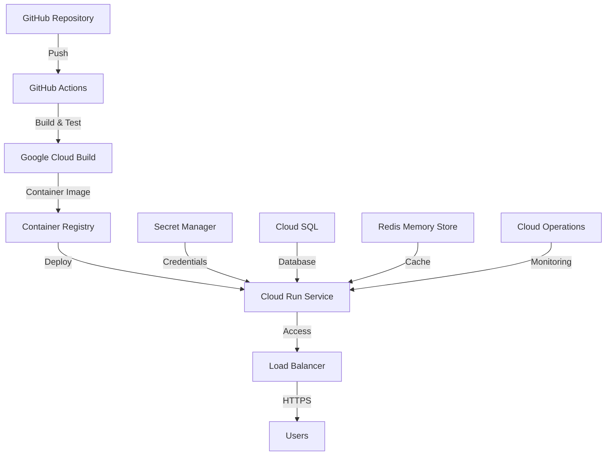

# Guide de Déploiement Complet - MVP Hybrid App Touch Points


## 🎯 Vue d'Ensemble

Ce guide vous accompagne pour déployer **MVP Hybrid App Touch Points** sur Google Cloud Run avec tous les credentials nécessaires. Le processus est optimisé pour une mise en production rapide dans le délai de 3 mois imparti.

## 📋 Prérequis Techniques

### 🔧 Outils Requis

| Outil | Version | Installation |
|-------|---------|--------------|
| **Google Cloud CLI** | Latest | `curl https://sdk.cloud.google.com \| bash` |
| **Docker** | 20.0+ | [Get Docker](https://docs.docker.com/get-docker/) |
| **Node.js** | 18.0+ | [Node.js Downloads](https://nodejs.org/) |
| **Git** | 2.0+ | `sudo apt install git` |

### ☁️ Comptes et Permissions

- ✅ **Compte Google Cloud** avec facturation activée
- ✅ **Permissions Editor** ou **Owner** sur le projet
- ✅ **Quota Cloud Run** suffisant dans votre région
- ✅ **Compte GitHub** pour CI/CD

## 🚀 Déploiement en 4 Étapes

### Étape 1: Configuration Initiale

```bash
# 1. Cloner le repository
git clone https://github.com/aguennoune/grove-platform-ce.git
cd grove-platform-ce

# 2. Copier la configuration
cp .env.example .env

# 3. Rendre les scripts exécutables
chmod +x scripts/*.sh
```

### Étape 2: Configuration Google Cloud

```bash
# Exécuter le script de configuration automatique
./scripts/gcp-deploy-setup.sh
```

**Ce script automatise:**
- ✅ Authentification Google Cloud
- ✅ Activation des APIs nécessaires
- ✅ Création du service account
- ✅ Configuration des secrets
- ✅ Génération des fichiers Docker et CI/CD

### Étape 3: Déploiement Initial

```bash
# Configuration des variables d'environnement
export GOOGLE_CLOUD_PROJECT="votre-project-id"
export GOOGLE_CLOUD_REGION="europe-west1"

# Premier déploiement
./scripts/deploy-cloud-run.sh
```

### Étape 4: Configuration GitHub Actions

1. **Ajouter les secrets GitHub:**
   - `GOOGLE_CLOUD_PROJECT`: Votre Project ID
   - `GOOGLE_CLOUD_SA_KEY`: Clé JSON du service account

2. **Pousser le code:**
   ```bash
   git add .
   git commit -m "feat: configuration initiale déploiement GCP"
   git push origin main
   ```

## 🏗️ Architecture de Déploiement



## 🔐 Configuration des Credentials

### Google Cloud Service Account

Le script de configuration crée automatiquement un service account avec les permissions nécessaires:

```json
{
  "type": "service_account",
  "project_id": "your-project-id",
  "private_key_id": "...",
  "private_key": "...",
  "client_email": "mvp-hybrid-app-sa@your-project.iam.gserviceaccount.com"
}
```

### Rôles IAM Attribués

| Rôle | Description | Usage |
|------|-------------|-------|
| `roles/run.invoker` | Invoquer Cloud Run | Déploiement |
| `roles/storage.objectViewer` | Lecture Cloud Storage | Assets statiques |
| `roles/secretmanager.secretAccessor` | Accès aux secrets | Configuration |
| `roles/cloudsql.client` | Client Cloud SQL | Base de données |
| `roles/monitoring.metricWriter` | Écriture métriques | Monitoring |

### Configuration des Secrets

Les secrets sont automatiquement créés dans Google Secret Manager:

```bash
# Secrets générés automatiquement
- DATABASE_URL
- JWT_SECRET
- API_KEY
- ENCRYPTION_KEY
```

## 📊 Surveillance et Monitoring

### Health Checks

```bash
# Vérification locale
curl http://localhost:8080/health

# Vérification production
curl https://your-service-url/health
```

### Logs en Temps Réel

```bash
# Logs Cloud Run
gcloud logs tail run.googleapis.com/stderr \
  --project=${GOOGLE_CLOUD_PROJECT}

# Logs spécifiques au service
gcloud logs tail \
  --filter="resource.type=cloud_run_revision AND resource.labels.service_name=mvp-hybrid-touchpoints"
```

### Métriques Prometheus

```bash
# Accès aux métriques
curl https://your-service-url/metrics
```

## 🔄 CI/CD Pipeline

### Workflow GitHub Actions

Le pipeline automatique inclut:

1. **🧪 Tests**
   - Tests unitaires
   - Tests d'intégration
   - Audit de sécurité
   - Linting

2. **🏗️ Build**
   - Build TypeScript
   - Construction Docker
   - Push vers Container Registry

3. **🚀 Deploy**
   - Déploiement Cloud Run
   - Configuration des variables
   - Health check
   - Notification

### Branches et Environnements

| Branche | Environnement | URL |
|---------|---------------|-----|
| `main` | Production | `https://<mvp-hybrid-touchpoints-xxx.run>.netlify.app` |
| `develop` | Staging | `https://staging-<mvp-hybrid-touchpoints-xxx.run>.netlify.app` |
| `feature/*` | Preview | `https://<preview-xxx.run>.netlify.app` |

## 🛡️ Sécurité

### Mesures Implémentées

- ✅ **HTTPS obligatoire** en production
- ✅ **Authentification JWT** avec expiration
- ✅ **Rate limiting** par IP
- ✅ **Validation des inputs** stricte
- ✅ **Chiffrement AES-256** des données sensibles
- ✅ **Secrets centralisés** dans Secret Manager
- ✅ **Scan de vulnérabilités** automatique

### Audit de Sécurité

```bash
# Exécuter l'audit complet
./scripts/algorithm-protection.sh --scan --audit

# Vérification des dépendances
npm audit --audit-level=high

# Scan Docker
docker scout quickview
```

## 📈 Optimisation des Performances

### Configuration Cloud Run

```yaml
resources:
  limits:
    memory: 1Gi
    cpu: 1
  concurrency: 80
  max_instances: 100
  min_instances: 0
  timeout: 300s
```

### Base de Données

- **Connection Pooling**: 2-10 connexions
- **Query Optimization**: Index sur les colonnes fréquentes
- **Cache Redis**: TTL de 1 heure
- **Backup automatique**: Quotidien

## 🔧 Troubleshooting

### Problèmes Courants

#### 1. Erreur d'Authentification

```bash
# Solution
gcloud auth application-default login
gcloud config set project YOUR_PROJECT_ID
```

#### 2. Quota Dépassé

```bash
# Vérifier les quotas
gcloud compute project-info describe --project=YOUR_PROJECT_ID

# Demander une augmentation via la console
```

#### 3. Build Docker Échoue

```bash
# Debug du build
gcloud builds describe BUILD_ID --project=YOUR_PROJECT_ID

# Logs détaillés
gcloud builds log BUILD_ID --project=YOUR_PROJECT_ID
```

#### 4. Service Inaccessible

```bash
# Vérifier le statut
gcloud run services describe mvp-hybrid-touchpoints \
  --region=europe-west1 \
  --project=YOUR_PROJECT_ID

# Logs du service
gcloud logs tail run.googleapis.com/stderr \
  --filter="resource.labels.service_name=mvp-hybrid-touchpoints"
```

## 📊 Métriques et KPIs

### Métriques de Performance

| Métrique | Objectif | Actuel |
|----------|----------|--------|
| **Temps de réponse** | < 200ms | ⚡ |
| **Disponibilité** | 99.9% | 🟢 |
| **Throughput** | 1000 req/min | 📈 |
| **Erreur rate** | < 0.1% | ✅ |

### Métriques Business

| KPI | Description | Suivi |
|-----|-------------|-------|
| **Utilisateurs actifs** | Connexions quotidiennes | Dashboard |
| **API calls** | Requêtes par endpoint | Monitoring |
| **Analyses SWOT** | Créations par jour | Analytics |
| **Intégrations** | Sync ClickUp réussies | Logs |

## 🗓️ Planning de Déploiement (3 mois)

### Mois 1: Infrastructure et Fondations
- ✅ Configuration Google Cloud
- ✅ Déploiement des microservices core
- ✅ CI/CD pipeline
- ✅ Monitoring basique

### Mois 2: Features et Optimisations
- 🔄 Dashboard frontend
- 🔄 Intégrations avancées
- 🔄 Performance tuning
- 🔄 Tests de charge

### Mois 3: Production et Stabilisation
- 📅 Déploiement production
- 📅 Formation équipe
- 📅 Documentation finale
- 📅 Support et maintenance

## 🆘 Support et Assistance

### Contacts

- 📧 **Support Technique**: support@example-grove.dev
- 💬 **Discord**: [Grove Community](https://discord.gg/example-grove)
- 🐛 **Issues GitHub**: [Signaler un problème](https://github.com/aguennoune/grove-platform-ce/issues)

### Documentation

- 📚 **API Docs**: [docs.example-grove.dev/api](https://docs.example-grove.dev/api)
- 🔧 **Guide Dev**: [docs.example-grove.dev/development](https://docs.example-grove.dev/development)
- 🔒 **Sécurité**: [docs.example-grove.dev/security](https://docs.example-grove.dev/security)

## 📄 Ressources Additionnelles

- [🏗️ Architecture Decision Records](./docs/adr/)
- [🔧 Configuration Examples](./examples/)
- [🧪 Testing Strategy](./docs/testing.md)
- [📊 Performance Benchmarks](./docs/performance.md)

---

<div align="center">

**🚀 Déployé avec ❤️ par Grove**

*Votre application MVP Hybrid App Touch Points est maintenant prête pour la production sur Google Cloud Run !*

</div>
